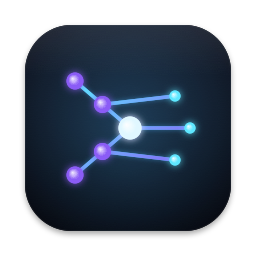

# Ante

**[anterm.app](https://anterm.app)** · [Download](https://github.com/ishan97/ante/releases/latest/download/Ante.dmg) · macOS 14+, Apple silicon

A native macOS terminal built as a workspace: projects and sessions in a sidebar, sessions that
land in History on quit, splits, a global show/hide hotkey, themes, and shell integration that
never touches your rc files.

## Build

    ./scripts/bootstrap.sh     # installs xcodegen, generates Ante.xcodeproj
    ./scripts/test.sh          # tests every package, builds the app
    ./scripts/package.sh       # Release build → dist/Ante-<version>.dmg

Requires Xcode 26 and the Metal toolchain (`xcodebuild -downloadComponent MetalToolchain`).
`package.sh` signs ad-hoc by default; see **Distributing** below for a signed, notarized build.

## Configure

`~/.config/ante/config.toml`, hot-reloaded. Settings (⌘,) edits the same file and keeps your
comments. `[window] width` and `height` (fractions of the screen, default 0.8) set the size Ante
opens at, from the top-left of the screen; 0 makes it reopen at the size and place you left it. Themes go in `~/.config/ante/themes/*.toml`; import iTerm2 `.itermcolors` or Alacritty
`.toml` from Settings → Appearance.

## Updates

Ante checks `https://raw.githubusercontent.com/ishan97/ante/main/appcast.xml` once a day and
offers new versions through Sparkle's standard dialog; nothing else is sent, and the check can be
turned off in Settings → General → Updates (Ante → Check for Updates… still works). Downloads are
verified against the EdDSA key in the app before they are installed. The newest DMG is always at
`https://github.com/ishan97/ante/releases/latest/download/Ante.dmg`.

## Sessions

`⌘⇧S` (or the pinned **Sessions** entry in the sidebar) opens a board of every live pane, sorted
into **Working / Waiting for you / Idle**, with the agent in the foreground (Claude Code, Codex,
Aider, Gemini, Goose, Amp, OpenCode, Cursor, Pi, or a plain shell/command) and how long it has been
in that state. Below the board, an **Activity** strip shows a year of prompts per day, with streaks,
read from the agents' own history files. **History** lists past sessions straight from each agent's
storage — Claude Code (`~/.claude/projects`), Codex (`~/.codex/sessions` and `archived_sessions`),
OpenCode (`~/.local/share/opencode/opencode.db`), Pi (`~/.pi/agent/sessions`) — plus agent
sessions closed in Ante (plain shells have nothing to resume, so they are not kept); click one to
open a pane in that project and resume it (`claude --resume …`,
`codex resume …`, `opencode --session …`, `pi --session …`).

"Waiting for you" is definite when an agent hook says so and probable when an agent has been
quiet for `[agents] quiet_seconds` (default 8). The moment a session moves into that column Ante
posts a macOS notification (click it to jump to the session) and plays the sound you pick under
Settings → Agents (`[agents] notify`, `notify_sound`); the Dock icon counts waiting sessions. Settings → Agents can install the Claude Code
hook (into `~/.claude/settings.json`, backed up; removable) for the definite signal.

## Keys

| | |
|---|---|
| ⌘T / ⌘W | new session / close pane |
| ⌘D / ⌘⇧D / ⌘⌥D / ⌘⌥⇧D | split right / down / left / up |
| ⌘⌥←↑→↓ | focus pane |
| ⌘1–9, ⌘⇧[ ] | jump between sessions |
| ⌘F | find in scrollback |
| ⌘K | clear pane |
| ⌘↩ | fill the screen (menu bar and Dock slide away); press again to go back. The hotkey hides and shows the window as it is |
| ⌘= / ⌘- / ⌘0 | bigger / smaller / actual text size (Monaco 12 by default, like iTerm2) |
| ⌘⇧S | sessions board |
| ⌘⌥S | show / hide the sidebar |
| ⌘⇧O | insert file path (or drop files onto the terminal) |
| ⌘⇧T | to-do list & notes (the checklist button in the toolbar shows how many are open) |
| — | focus timer (the timer button in the toolbar; 25/5 by default, long break every fourth block) |
| ⌘⇧P | command palette |
| ⌘↑ / ⌘↓ | previous / next command |
| ⌘⇧A | select last command output |
| ⌘-click | open link or file |
| ⌥` | drop Ante over the current app; press again to hide and return to it (rebind in Settings) |

Every split pane has a close button; the cursor is a steady block by default (`[cursor]` in config). Rebind these under Settings → Keys (or `[keys]` in config.toml).

## Layout

`Packages/AnteCore` (model, state, config), `AnteTerm` (SwiftTerm + OSC 133/7 tee), `AnteTheme`,
`AnteUI` (SwiftUI shell), `AntePanel` (global hotkey). Design notes and reviews live under `docs/`.

## Brand

The icon is the neural chevron: a prompt `>` built from glowing nodes and links — a terminal
with an AI inside it. It is drawn by `scripts/render-icon.swift` at every size
(`swift scripts/render-icon.swift 1024 out.png`; `docs/brand/ante-icon-256.png` is a render).

## Versioning

Ante follows [semantic versioning](https://semver.org): **major** for changes that break existing
configs or behaviour people rely on, **minor** for new features, **patch** for fixes only. The
version lives in `project.yml` (`CFBundleShortVersionString`); the build number
(`CFBundleVersion`) is the commit count, which Sparkle compares, so it always grows.
`scripts/prepare-release.sh <version>` stamps both, commits, publishes and tags.

## Distributing

`scripts/package.sh` builds `dist/Ante-<version>.dmg`. Ad-hoc signed by default, which is fine on
your own Mac; anyone else gets Gatekeeper's "Apple could not verify" warning. A real release is
signed and notarized through Xcode and then fed to Sparkle:

1. `scripts/prepare-release.sh <version>` — stamps the version and build number, commits, publishes
   the tree and tags it `v<version>`.
2. In Xcode: Product → Archive → Distribute App → Direct Distribution → Upload. When Apple's
   notarization finishes, Export the app.
3. `scripts/dmg-from-app.sh <exported Ante.app>` — wraps it in a DMG, staples the ticket, signs the
   DMG for Sparkle (the private key from `generate_keys` in your login keychain) and updates
   `appcast.xml`.
4. `gh release create v<version> dist/Ante.dmg --title "Ante <version>"`, then commit
   `appcast.xml` and `scripts/publish.sh "release: <version> appcast"`. Running copies see the
   update within a day.

With a Developer ID certificate in the local keychain and a notarytool profile
(`xcrun notarytool store-credentials ante …`), `ANTE_SIGN_IDENTITY=auto scripts/package.sh` does
steps 2 and 3 in one go; `ANTE_NOTARIZE=0` skips the notary submission (the signature still
fetches a timestamp from Apple) — enough for your own Macs, not for others.

## License

MIT — see `LICENSE`. Bundled fonts, colour schemes, and Swift packages keep their own licences,
listed in `THIRD_PARTY_NOTICES.md`. Contributions are welcome; see `CONTRIBUTING.md`.
